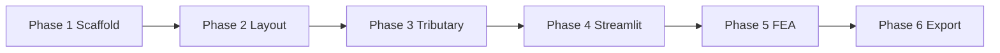

# Panel Calculator — Product Breakdown Structure (PBS)

**Source:** `plan de trabajo - Panel Calculator.txt`  
**Project:** Ferrose — Solar panel layout, tributary loads, FEA, and BOM calculator  
**Status:** In progress — Phase 2 complete

---

## Legend

| Tag | Meaning |
|-----|---------|
| `[library]` | Dependency / package install |
| `[key]` | Milestone — verify before moving on |
| `[critical]` | High-risk item — double-check units, codes, or reference case |
| `[added]` | Enhancement beyond minimum scope |

---

## Progress Summary

| Phase | Name | Tasks | Done |
|-------|------|-------|------|
| 1 | Project scaffold | 9 | 9 / 9 |
| 2 | Data model & layout | 9 | 9 / 9 |
| 3 | Tributary area model | 6 | 0 / 6 |
| 4 | Streamlit UI | 11 | 0 / 11 |
| 5 | FEA & code checks | 14 | 0 / 14 |
| 6 | Results & export | 7 | 0 / 7 |
| **Total** | | **56** | **18 / 56** |

---

## Phase 1 — Project Scaffold

### 1.1 Repository & folder structure

- [x] **1.1.1** Create VS Code project with folder structure: `/core`, `/ui`, `/tests`, `/outputs`
- [x] **1.1.2** Initialize Git repository
- [x] **1.1.3** Commit folder scaffold as first commit
- [x] **1.1.4** Create `.gitignore` for Python (`venv`, `__pycache__`, `.env`)

### 1.2 Dependencies

- [x] **1.2.1** `[library]` Install `numpy`, `pandas`, `plotly` (not matplotlib — Plotly works natively in Streamlit)
- [x] **1.2.2** `[library]` Install PyNite or anaStruct for FEA — test a single-beam example to confirm it works
- [x] **1.2.3** `[library]` Install Streamlit and confirm hello-world app runs in browser
- [x] **1.2.4** `[library]` Install `openpyxl` and `reportlab` for Excel and PDF export
- [x] **1.2.5** Pin all versions in `requirements.txt`

**Phase 1 exit criteria:** Repo initialized, folders in place, all packages installed, Streamlit hello-world runs.

---

## Phase 2 — Data Model & Layout Logic

### 2.1 Core dataclasses

- [x] **2.1.1** Define `PanelSpec` dataclass: `length`, `width`, `weight`, `tilt_angle`
- [x] **2.1.2** Define `LayoutConfig` dataclass: `mid_clamp_gap`, `alley_width`, `max_area_x`, `max_area_y`

### 2.2 Layout functions

- [x] **2.2.1** Build `pair_panels()` — returns bounding box for 2 panels including 1" mid-clamp gap
- [x] **2.2.2** Build `accumulate_row()` — spaces pairs with alley every 2 pairs (4 panels); returns list of `(x, y, w, h)` rectangles
- [x] **2.2.3** Build `accumulate_grid()` — repeats rows in Y direction with alley insertion
- [x] **2.2.4** Build `fit_to_area()` — reduces panel count step-by-step until grid fits within `max_area_x × max_area_y`

### 2.3 Validation & visualization

- [x] **2.3.1** `[library]` Write unit tests for each layout function using `pytest`
- [x] **2.3.2** `[key]` Generate Plotly figure showing panel rectangles, alley gaps, and bounding box — confirm visually with a known layout

**Phase 2 exit criteria:** All layout functions tested; Plotly layout matches expected geometry for a reference case.

---

## Phase 3 — Tributary Area Model

### 3.1 Tributary computation

- [ ] **3.1.1** `[added]` Build `compute_tributary_zones(columns, grid_bbox)` — assigns each column a rectangular catchment area
- [ ] **3.1.2** `[key]` Calculate total tributary area per column and verify all zones sum to total panel area (no gaps or overlaps)
- [ ] **3.1.3** Store tributary rectangle per column as an attribute — feeds FEA load processor in Phase 5

### 3.2 Visual layer

- [ ] **3.2.1** Overlay tributary zones on Plotly canvas as semi-transparent filled rectangles
- [ ] **3.2.2** `[added]` Add hover tooltip per zone: column ID, tributary area (m²), estimated load (kN)
- [ ] **3.2.3** Color-code zones by load intensity (light green → amber → red as load increases)

**Phase 3 exit criteria:** Tributary zones partition panel area exactly; visual overlay and tooltips work on reference layout.

---

## Phase 4 — Streamlit Layout & Live BOM

### 4.1 App shell & inputs

- [ ] **4.1.1** Create `app.py` with sidebar inputs: panel dims, weight, max area, column spacing
- [ ] **4.1.2** `[critical]` Add wind load section: wind speed (km/h), exposure category (A–D per CFE NTC-Viento 2020)
- [ ] **4.1.3** Main area shows interactive Plotly canvas — grid + columns + tributary zones

### 4.2 Column placement

- [ ] **4.2.1** Build `default_columns()` — equal spacing aligned to truss span (default 3–4 m)
- [ ] **4.2.2** Allow coordinate override: text input for custom column X,Y — updates canvas on Enter
- [ ] **4.2.3** Add obstacle zone input: user enters bounding box coords — columns inside flagged red and excluded from FEA

### 4.3 Live BOM

- [ ] **4.3.1** `[added]` Compute and display BOM live on every input change (no separate export step to see counts)
- [ ] **4.3.2** Show: panel count, column count, total PTR 4×4 length (m), truss chord length (m), base plates
- [ ] **4.3.3** Show estimated steel tonnage alongside BOM for quick cost estimation

**Phase 4 exit criteria:** Streamlit app runs with live canvas, wind inputs, column overrides, obstacle exclusion, and live BOM.

---

## Phase 5 — Materials, Loads, FEA & Code Checks

### 5.1 Material & section properties

- [ ] **5.1.1** Define `SteelSection` dataclass: `A` (area), `Ix` (moment of inertia), `Fy` (yield strength)
- [ ] **5.1.2** `[critical]` Enter PTR 4"×4" values from IMCA or AISC table — double-check units (mm⁴ not cm⁴)
- [ ] **5.1.3** Enter secondary beam and Warren truss chord section values

### 5.2 Load combinations

- [ ] **5.2.1** `[key]` Build `load_combinations()` — returns table of factored combos per CFE (or ASCE 7 if preferred)
- [ ] **5.2.2** `[added]` Display load combination table in Streamlit UI for engineer audit before solver runs
- [ ] **5.2.3** Include at minimum: `1.2D + 1.6L`, `0.9D + 1.6W`, `1.2D + 1.0W + 1.0L`

### 5.3 FEA integration

- [ ] **5.3.1** Map confirmed column positions as fixed or pinned nodes in PyNite/anaStruct
- [ ] **5.3.2** Apply tributary area loads from Phase 3 onto beam elements
- [ ] **5.3.3** Run solver for each load combination; store results per combo
- [ ] **5.3.4** Extract: max bending moment, max axial force, max deflection per element

### 5.4 Code checks

- [ ] **5.4.1** `[key]` Check bending stress: `fb = M/S ≤ 0.66Fy` (or LRFD equivalent)
- [ ] **5.4.2** `[key]` Check deflection: `δmax ≤ L/240` (or project-specified limit)
- [ ] **5.4.3** Flag each element PASS (green) / WARN (amber, >80% utilization) / FAIL (red)
- [ ] **5.4.4** `[critical]` Run Phase 0 reference case through solver — assert match to hand calc within ±2%

**Phase 5 exit criteria:** FEA runs all combos; code checks and utilization flags correct; reference case within ±2% of hand calculation.

---

## Phase 6 — Results Dashboard & Export

### 6.1 Results dashboard

- [ ] **6.1.1** Overlay PASS/WARN/FAIL color on each beam element in Plotly canvas
- [ ] **6.1.2** Add results table below canvas: element ID, max moment, utilization ratio, status
- [ ] **6.1.3** Show governing load combination for each failed element

### 6.2 Export

- [ ] **6.2.1** `[library]` Export to Excel: one sheet for BOM, one for load combinations, one for element results
- [ ] **6.2.2** `[library]` Export to PDF: layout diagram + results summary + pass/fail table on a single page
- [ ] **6.2.3** Include timestamp and input parameter summary on cover page of both exports

**Phase 6 exit criteria:** Full results UI; Excel and PDF exports complete with metadata.

---

## Dependency Graph (phase order)

---

## Reference & verification checklist

Use before marking the project complete:

- [ ] All 56 PBS tasks checked
- [ ] `pytest` passes for layout and tributary modules
- [ ] Streamlit app: responsive at common viewport widths
- [ ] Plotly canvas: panels, alleys, columns, tributary zones, and FEA status colors render correctly
- [ ] Phase 0 / reference case: FEA vs hand calc within ±2%
- [ ] Excel and PDF exports open and match on-screen results
- [ ] `README/ChangeLog.md` updated per approved changes
- [ ] Failures logged in `README/FAIL_LOG.md` if any occurred

---

## Notes for execution (per `README/Prompt.md`)

1. Propose plan updates before deviating from this PBS.
2. Write tests before or alongside implementation (Phase 2+).
3. Log failures in `README/FAIL_LOG.md`; log approved changes in `README/ChangeLog.md`.
4. Treat `[critical]` items as blocking gates — do not skip verification.
